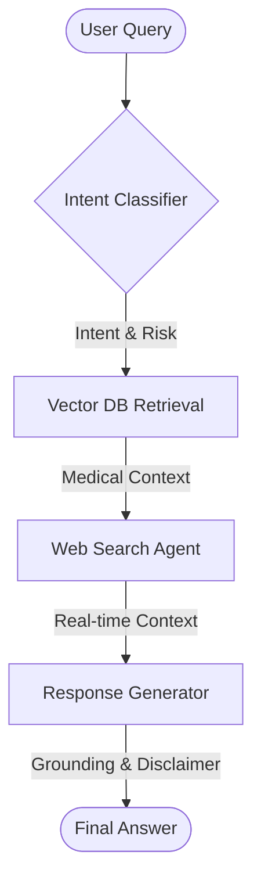

# 🏥 MedVeda-AI: The Next-Gen RAG Medical Assistant

[](https://www.python.org/)
[](https://react.dev/)
[](https://fastapi.tiangolo.com/)
[](https://python.langchain.com/)
[](https://tailwindcss.com/)

**MedVeda-AI** is a premium, end-to-end medical chatbot powered by a state-of-the-art **RAG (Retrieval-Augmented Generation)** architecture. It bridges the gap between complex medical literature and users by providing context-aware, medically grounded, and empathetic healthcare insights.

---

## 🌟 Key Features

- **🧠 Advanced RAG Architecture**: Grounded in trusted medical encyclopedias (The Gale Encyclopedia, The Merck Manual) to minimize hallucinations.
- **⚡ High-Speed Inference**: Powered by **Groq LPU** (Llama-3.3-70b) for sub-2-second responses.
- **🕸️ Agentic Web Search**: Automatically switches to **DuckDuckGo** for real-time news and general facts.
- **🔐 Secure Auth**: Seamless integration with **Google OAuth2** for persistent user sessions.
- **📜 Intelligent Chat History**: Database-backed conversation persistence with automatic title generation.
- **🎨 Premium UI/UX**: Built with **React 19**, **Framer Motion**, and **PrimeReact** for a smooth, high-fidelity experience.
- **⚠️ Safety First**: Integrated risk classification and dynamic medical disclaimers.

---

## 🏗️ System Architecture

MedVeda-AI uses a sophisticated **LangGraph** workflow to ensure precision and safety in every response.



---

## 🚀 Tech Stack

| Layer | Technologies |
| :--- | :--- |
| **Frontend** | React 19, Vite, Tailwind CSS 4, Framer Motion, Lucide, PrimeReact |
| **Backend** | FastAPI, Uvicorn, LangChain, LangGraph |
| **AI Models** | Groq (Llama-3.3-70b-versatile), HuggingFace Embeddings |
| **Databases** | Pinecone (Vector), SQLAlchemy (Users), JSON (Chat Persistence) |
| **Auth** | Google OAuth 2.0, JWT |

---

## 🛠️ Installation & Setup

### 1. Prerequisites
- Python 3.10+
- Node.js 18+
- [Conda](https://docs.conda.io/en/latest/) (Recommended)

### 2. Backend Setup
```bash
# Navigate to backend
cd backend

# Create and activate environment
conda create -n medveda python=3.10 -y
conda activate medveda

# Install dependencies
pip install -r requirements.txt

# Configure .env
cp .env.example .env # Add your keys (GROQ, PINECONE, GOOGLE_CLIENT_ID, etc.)

# Run server
python main.py
```

### 3. Frontend Setup
```bash
# Navigate to frontend
cd frontend

# Install dependencies
npm install

# Run dev server
npm run dev
```

---

## 📂 Project Structure

```text
MedVeda-AI/
├── backend/            # FastAPI Server & AI Logic
│   ├── src/            # LangGraph Workflows, Models, Prompts
│   ├── data/           # Persistent JSON Chat Storage
│   └── main.py         # Application Entry Point
├── frontend/           # React 19 Vite App
│   ├── src/            # UI Components & Contexts
│   └── public/         # Static Assets
├── .gitignore          # Git configuration
├── LICENSE             # Open Source License
└── MedVeda_AI_Documentation.md  # Detailed Project Synopsis
```

---

## ⚠️ Disclaimer

**MedVeda-AI is for informational and educational purposes only.** It is not a substitute for professional medical advice, diagnosis, or treatment. Always seek the advice of your physician or other qualified health providers with any questions you may have regarding a medical condition.

---

## 📄 License

This project is licensed under the MIT License - see the [LICENSE](LICENSE) file for details.

---

<p align="center">
  Made with ❤️ by <a href="https://github.com/Koustubhmk09">Koustubhmk09</a>
</p>
